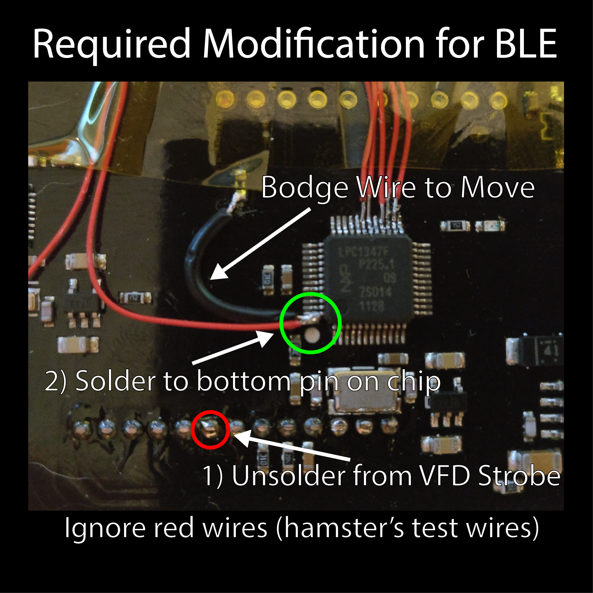

# DC801 Defcon 22 party badge

Brought to you by DC801, theTransistor, and 801 Labs
Special thanks to: **devino**, **nemus**, and **yukaia** - the few key people in this project.

Code updated to 2.1 by **hamster** (twitter @hamster)

# NOTE - Read this fully to update your badge to 2.1!

## Hardware

## Capabilities of the badge
**Chipset / Hardware:**

1. NXP LCP1347 mCU - Changed from the STM32 chip that was originally planned.
 72 MHZ Arm mCU
 32 bit instruction set
 64 kB flash
 8  kB ram
 4  kB EEPROM
2. nRF8001 Bluetooth LE module
3. MCP73833-FCI/UN LiPo Charger
 Low Voltage Protection
4. CU16025-UW6J 16x2 VFD Display
5. IS31AP4991 AB Audio Amplifier w/ mini speaker
6. WS2812B RGB Led
7. Test LED (on the rear of the board)
8. 4 User Buttons, and 1 Reset Button
9. "2000" mAH Battery
10. Staying on your wrist

## Required hardware change for v2.1 functionality

The BTLE RDY pin was mistakenly tied to the VFD Strobe.  As such, the ARM proc can't tell when the BLE chip wants something, so to make this firmware work, you're going to have to move it.  Refer to this image:




# Software

## Hot dog it works!
 
## This new app will:

1) Burn your retina with the RGB neopixel
2) Spew sensitive data via BLE
3) Tell wild lies about you via the display
 
 
At first boot, the badge will display a banner.  Below it is the word 'Menu' which should clue you in that
you can press the A button to enter the menu, and an 8 char username.  The username is also broadcast as the
Bluetooth device name.

Initially, BLE is disabled.  Enter the menu system to change your username, and enable BLE.

Once enabled, the badge will begin broadcasting that is a DC801 Defcon 25 badge.  Why 25?  Well... no other badges
recognize Defcon 22 badges, so I thought perhaps it would be more fun if they could see this one.  If you remember
the actual Defcon 25 badge, you recall there was a game of infection.  I didn't implement it on this badge, for reasons
I will get into in a moment.

The badge will then have BLE enabled, but it won't be pairable.  A new menu option will appear to allow pairing.  Turn it on.
Connect to your badge with your phone or whatever - I recommend using the Nordic nRF Connect app for Android.  Once you connect to
the badge, you will see a list of characteristics that the badge broadcasts.  Some are readable without pairing.

If you pair with the badge, or click on an item that needs you to be paired, your phone should pop up a 'device wants to pair
with you' item, and the pairing key will display on your badge.  Enter it in.  If you get it wrong or take more than 30 seconds,
pairing will fail.  The badge will show if it worked out or not.

Once you are paired, the LED will glow to show that you are paired.  Now, you can use the Nordic UART characteristic to send data
to the badge.  Known bug here: if you try to read data, the BLE stack on the badge will reset.  Not that it has anything interesting
to say anyway.  In the nRF Connect app, that's the TX characteristic - it's backwards from what you would expect.  Use the RX one to send
a string to the badge.  Holy hot cakes!  The top line changes!  This is implemented as a circular buffer, in that if you send more
than 16 chars it will wrap back around, but not in a way that's useful.  Everytime you send a new string, it will reset to position 0,0
and draw the string again.  Get funky with it!

To delete any stored pairing data from your badge, there is a menu option for that.  It might or might not be useful for you - the badge
wants to re-pair most of the time after a power cycle anyway.  Probably a bug here for me to fix.

To reset the badge to factory condition, hold down button A while powering it on or resetting it.  The display will say 'Cleared!'
once the stored data has been wiped.

Also in the characteristics, there are various strings present, and the nRF8001 chip temperature in C can be read.


# Other notes


## Bluetooth and the nRF8001

The nRF8001 BLE chip really mucks with your head.  For instance, the advertisement data can't be changed without resetting the chip.
This data, along with all the rest of the config, is spelled out in the setup messages in services.h.  That whole thing is generated
with the nRF Go Studio app or whatever it's called.  There is a document out there that describes most of the setup data, but it's
almost entirely a black box.

In order to change the advertised name, I've employed a hack.  I counted the actual offset in the setup data where the name is set,
and set that as a #define.  Then, when you update your username, I go write that username to the setup messages directly, and
force the chip to reset.  When it resets, this is detected, and the setup routine re-generates the CRC for the setup data and
programs the BLE chip.

So why no vector?  Since the advertised data needs to change periodically to play the game (to change your random number), the BLE
would need to reset fairly often as well.  While it is possible to ask the nRF8001 to re-connect to your phone after a reset, I felt
that it's a better experience to not have the BLE stack reset itself somewhat randomly.  Further, the nRF8001 is a peripheral only -
it can't handle any central duties, so it cannot scan for any other BLE devices.  This means it would only be able to play half the
game anyway.  Ah well.


## Programming

To program, hook the USB up to your computer.  Hold down button B and tap reset.  It should then show up as a USB stick or hard
drive as CRP_DISABLED.  Delete 'firmware.bin' off the stick.  Then drag and drop the new 'firmware.bin' onto the stick.  After it has
copied, tap reset to boot to the new code.

Notes here: firmware.bin must be exactly 64k.  It's always padded out to 64k.  It'll show as 0k on the 'hard drive' though.  That's
OK.  You can't read it back off the device, unfortunately.  The reason you have to delete first is that most operating systems
will copy then delete the old one, and there is not enough space for both.  It's gotta be an empty drive.


## Charging

The VFD inrush pulls enough that if your battery is flat and you are tyring to charge it with a wimpy USB port/charger, it's really
not going to go well for you.  An easy workaround is to force the device into programming mode, as per above.  The display won't turn on
and you can just leave it plugged in for an hour or so to get the battery charged enough that you can then play with it.  Just tap
reset to return to normal mode.


## TODO and etc

1) The speaker is not doing anything at the moment.  This is pretty easy to fix, and I might well get to it soon.
2) There is no way the system can tell what the battery voltage is.  It can only tell if your USB is plugged in or not.  Sorry!
3) No on/off switch or sleep mode currently implemented.  Charge often!
4) If your BLE won't work, make sure you read the readme on github and moved the bodge wire on the back of the board.  If you did that,
   and you set BLE to be enabled, well.. you might have a bad BLE chip.  Inspect the board under a microscope, replace the chip, or
   live with it.  These were never tested for functionality at the 'factory' as it were so who knows.
5) If your LED doesn't show all 3 colors (red, green, blue) at bootup, you probably have a bad diode.  Neopixels hate reflow solder.
   You can buy a new one from Adafruit or whatever, and replace it yourself.  It's not hard, but... it's a pain.  Careful not to
   rip the pads off the board like I did...


# Developing for the badge

## ARM toolchain for GCC

 Luckily for us, there is a nice Ubuntu ppa that covers this.  It's pretty simple to get installed ([taken from launchpad](https://launchpad.net/~team-gcc-arm-embedded/+archive/ubuntu/ppa)):

 ```
 $ sudo add-apt-repository ppa:team-gcc-arm-embedded/ppa
 $ sudo apt-get update
 $ sudo apt-get install gcc-arm-embedded
 ```
 
 Step 3 is a 70mB download from a slow server, so go get yourself a beer - you deserve it!

 Make sure it works

 ```
 $ arm-none-eabi-gcc --version 
 arm-none-eabi-gcc (GNU Tools for ARM Embedded Processors 6-2017-q2-update) 6.3.1 20170215 (release) [ARM/embedded-6-branch revision 245512]
 ```

## Build tools

 We need the build tools like make installed, so run:
	
 ```
 $ sudo apt-get install build-essential checkinstall
 ```

 After it completes, make should be installed on your system:

 ```
 $ make
 make: *** No targets specified and no makefile found.  Stop.
 ```

Binaries need to be padded to 64k.  A tool to accomplish this is included in the source and called by the Makefile.


## Schematic / Board Notes

Historic updates:

1. Removing the first button from the board and rerouting the to the USB
2. Removing the Resistor that was connecting the BTLE RDYN to the P0_16
3. Rerouting the BTLE RDYN to the VFD Strobe

2.1 update:

1. Move the BTLE RDYN from VFD Strobe to a spare pin on the chip (see )
